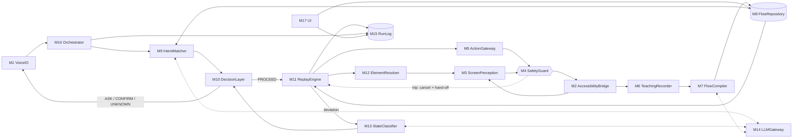
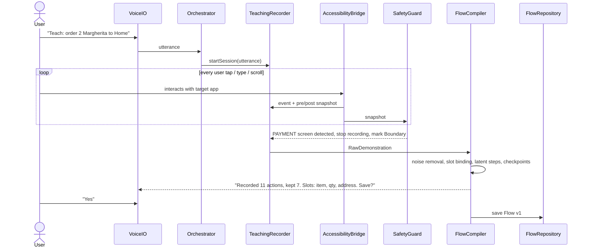
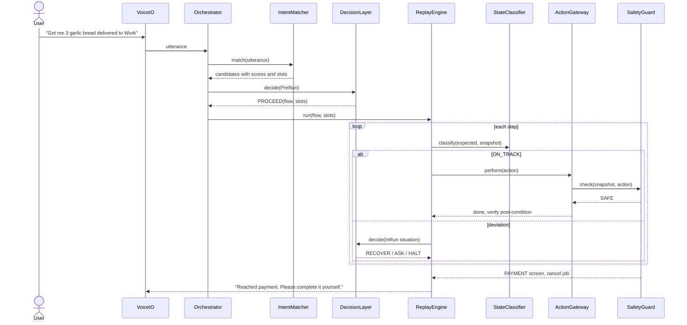
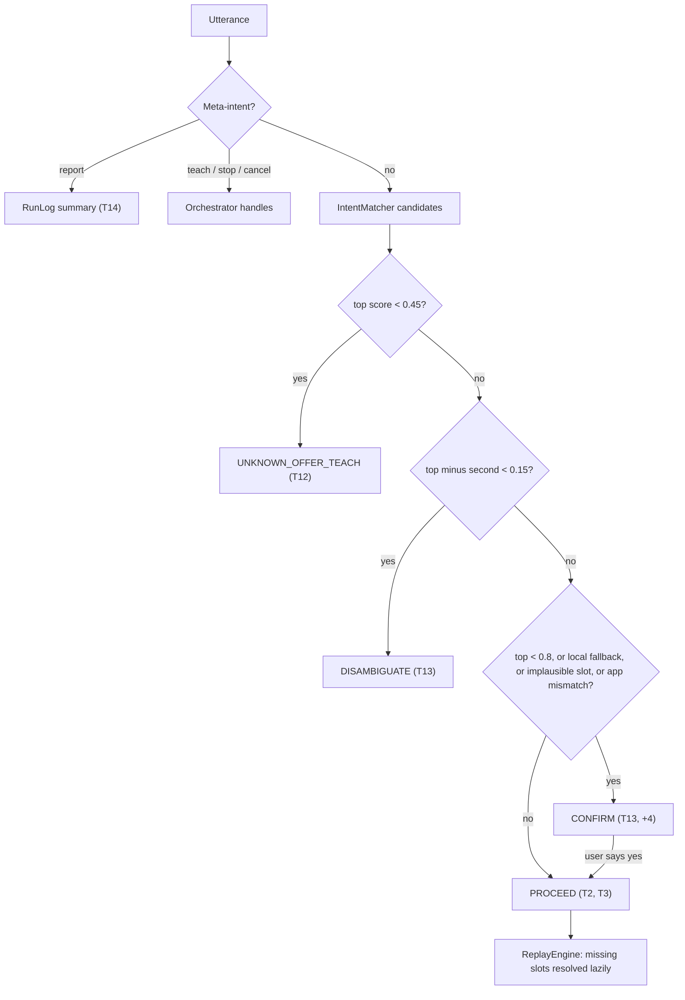
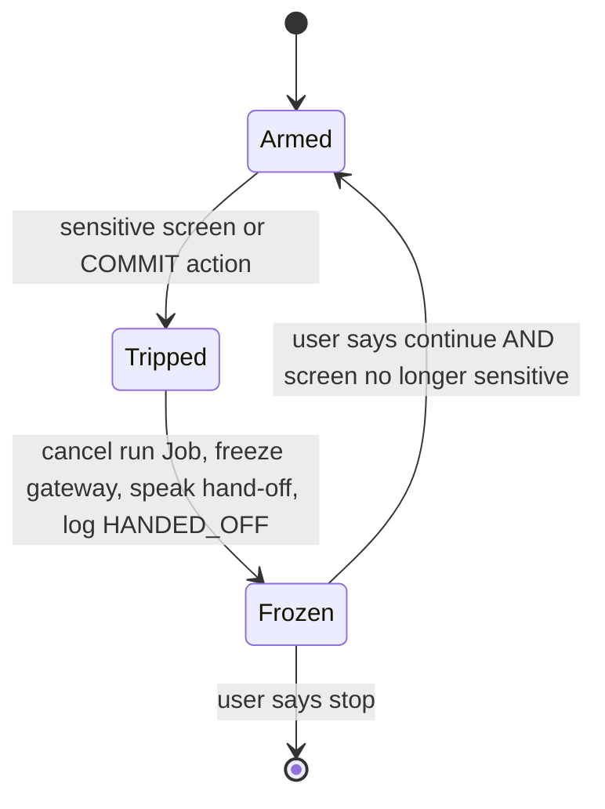
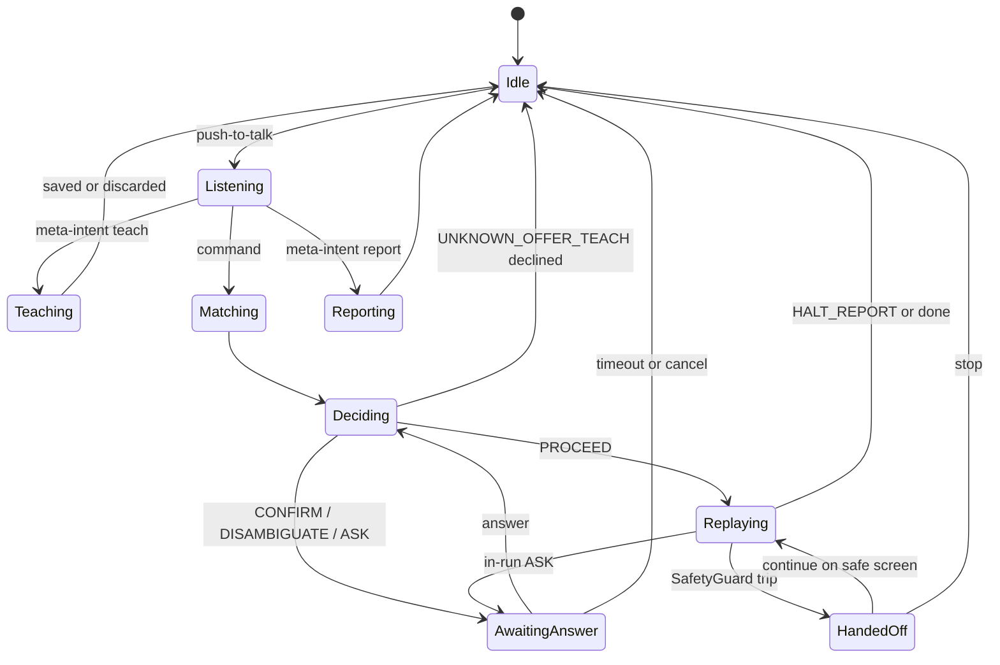

# EchoFlow — Architecture

EchoFlow is an Android app written in Kotlin. You teach it a task on your phone by speaking a command and then doing the task by hand with taps. Later it repeats the task when you say that command, a paraphrase of it, or a version with different values.

It uses **only the Android Accessibility Service APIs**. That means no app-specific SDKs, no deep links and no web fallbacks, and there are no hard-coded flows.

> Status: design document. No implementation code exists yet.
> See also: [TEST_MATRIX.md](TEST_MATRIX.md) (rubric traceability) · [LIMITATIONS.md](LIMITATIONS.md) (known gaps).

## Target apps (declared)

| Flow | App class | Apps | Slots |
|---|---|---|---|
| Flow 1 | Food delivery | Swiggy / Zomato-style | `item`, `qty`, `address` (list selection) |
| Flow 2 | E-commerce search | Amazon / Flipkart | `query` (plus `qty` where shown) |
| Cross-app bonus | E-commerce | Flow 2 replayed on Myntra | `query` |

The final list of declared apps will only include apps whose payment, OTP and login screens pass SafetyGuard validation (see [Build order](#build-order-risk-first), step 1).

## Technology choices

- **Language / min SDK:** Kotlin, `minSdk 30`. API 30 is needed for `AccessibilityAction.ACTION_IME_ENTER`, which submits search fields.
- **Automation:** `AccessibilityService` with `canRetrieveWindowContent`, `flagReportViewIds`, `flagRetrieveInteractiveWindows` and all event types. The overlay uses `TYPE_ACCESSIBILITY_OVERLAY`, so no `SYSTEM_ALERT_WINDOW` permission is needed.
- **Voice:** push-to-talk with Android `SpeechRecognizer` and `TextToSpeech`. A foreground service of type `microphone` holds the mic.
- **Language understanding:** a cloud LLM with structured JSON output. A deterministic on-device fallback takes over when the network or the LLM is unavailable.
- **Storage:** Room for flows, slot schemas, example utterances and run records. Flows can be exported as JSON.
- **Concurrency:** coroutines. Each replay is one cancellable `Job`, and a typed `SharedFlow<EchoEvent>` bus carries events between modules.

---

## 1. Invariants every module obeys

1. **The safety gate cannot be bypassed.** The only way to act on the device is `ActionGateway.perform(action)`, and every call passes `SafetyGuard` first. No other module has a reference to the service's action APIs.
2. **The LLM is advisory only.** It can suggest a flow, slot values or a target element. A local resolver must map that suggestion onto a real node, and SafetyGuard plus the action-risk check still gate it. The LLM never makes a safety decision.
3. **Fail closed.** If it is unclear whether a screen is sensitive, the app treats it as sensitive. If it is unclear which element to tap, the app asks instead of tapping.
4. **The matcher never triggers replay directly.** Every command goes IntentMatcher → DecisionLayer → ReplayEngine.
5. **Sensitive content is never persisted.** Text from password fields, OTP fields or screens classified as sensitive is never recorded, logged or sent to the LLM.

---

## 2. Module overview

| # | Module (package) | What it owns | Primary tests |
|---|---|---|---|
| M1 | **VoiceIO** (`voice/`) | Push-to-talk STT and TTS. A spoken question/answer primitive, `ask(question, answerType, choices?)` | All tests (I/O); T10–T13 questions |
| M2 | **AccessibilityBridge** (`accessibility/`) | The `AccessibilityService`: event stream, window/node-tree snapshots, the overlay, and the raw actions. Only ActionGateway can reach the raw actions | Infrastructure |
| M3 | **ScreenPerception** (`perception/`) | Converts the node tree into a `ScreenSnapshot` (normalized elements). Also computes the `ScreenFingerprint`, detects the script/language of on-screen text, and detects when the screen is idle or loading | T2, T7, T10 |
| M4 | **SafetyGuard** (`safety/`, no Android dependencies) | Classifies each screen (`SAFE / PAYMENT / OTP / PASSWORD / LOGIN / OPAQUE_UNKNOWN`) and each action (`SAFE / COMMIT / DESTRUCTIVE`). Issues hand-offs, stops teach recording, redacts content | **T11**, T1, T2, T10 |
| M5 | **ActionGateway** (`safety/gateway`) | The single place actions go through: tap, set text, IME enter, scroll, back, launch. Each action gets a safety check before it runs, then a second check on the next screen | T11, T10 |
| M6 | **TeachingRecorder** (`teach/`) | Teach-mode session: the teaching utterance plus a list of `RawStep` records. Drops taps on the overlay and password-field text | T1, T8 |
| M7 | **FlowCompiler** (`compile/`) | Turns the recorded steps into a parametrized `Flow`: noise removal, slot binding, latent-step inference, checkpoints and a semantic plan | T1, T4–T6, T8/T9, bonuses |
| M8 | **FlowRepository** (`flow/`) | Stores flows, versions, slot schemas, example utterances and step descriptors. JSON export | T1, T3 |
| M9 | **IntentMatcher** (`nlu/`) | Turns an utterance into a meta-intent plus a ranked list of `Candidate(flow, score, slots, missingSlots)` | T2, T3, T8/T9, T12, T13 |
| M10 | **DecisionLayer** (`decision/`) | Pure policy function that picks one `Decision` from a fixed set. Runs before a replay starts and again whenever the replay deviates | **T7, T10, T12, T13**, +3 |
| M11 | **ReplayEngine** (`replay/`) | Runs each step in order: resolve → gate → act → wait for idle → verify. Owns `RunContext` and the watchdog | T2–T6, T8/T9 |
| M12 | **ElementResolver** (`replay/resolve`) | Scores descriptors against the live screen, picks list items by slot value, adjusts steppers, scrolls to find targets | T4, T5, T6, T9 |
| M13 | **StateClassifier** (`decision/state`) | Compares the state step *k* expects with the current screen and returns a `Situation` | T7, T10 |
| M14 | **LLMGateway** (`llm/`) | JSON-schema prompts, a 3–4 s timeout, redaction, and an offline sentinel | T3, T7, T13, +4 |
| M15 | **RunLog** (`runlog/`) | `RunRecord` with per-step traces and a terminal state. Builds the "last run" summary from a template | **T14** |
| M16 | **Orchestrator** (`orchestrator/`) | The session state machine. Sends voice input either to the question waiting for an answer or to the matcher. Owns cancellation | Glue |
| M17 | **UI** (`ui/`) | Onboarding, Flow list and Flow Inspector, Runs list, overlay bubble with a STOP button | T1, T14, demo |

### How modules communicate

- **Commands** are `suspend` calls through interfaces. For example, `DecisionLayer.decide(ctx): Decision` and `ElementResolver.resolve(step, snapshot, slots): Resolution`.
- **Events** go on one `SharedFlow<EchoEvent>` bus. Event types include `SnapshotUpdated`, `StepStarted`, `StepVerified`, `SafetyTripped`, `QuestionAsked`, `QuestionAnswered` and `RunEnded`. RunLog, the overlay and the Orchestrator subscribe.
- **SafetyGuard has two roles.**
  - It is a **gate**: ActionGateway calls it synchronously before every action.
  - It is a **watcher**: it subscribes to every snapshot. When it trips, it cancels the replay `Job` directly and does not wait for the Orchestrator.

---

## 3. Teaching pipeline (T1, T8, +3 discard bonus)

### Step types (compiled `Flow`)

| Step | Meaning |
|---|---|
| `LaunchApp(pkg)` | Open the app with its launcher intent. This is the same intent the home screen uses, not a deep link |
| `Tap(desc)` | Tap the element that matches the `ElementDescriptor` |
| `TypeText(desc, value \| {slot})` | Set text, either a literal or a slot value |
| `SubmitIme` | `ACTION_IME_ENTER` on the focused field |
| `SelectFromList(containerDesc, {slot}, matchBy)` | Choose a list child by slot value, e.g. a search result or a saved address |
| `AdjustStepper(desc, {slot})` | Tap +/− until the displayed count equals the slot value |
| `Checkpoint(fingerprint, facts)` | The expected screen, plus facts from list screens such as cart line items |
| `Boundary(PAYMENT)` | The end of the flow. Replay always hands off here |

**`ElementDescriptor`** stores several features: resource-id, text or text template, content-desc, class/role, ancestor-path signature, sibling labels, normalized bounds, and index in list. The resolver scores all of them together instead of relying on one brittle XPath.

### FlowCompiler passes

1. **Noise removal (+3 bonus).**
   - Debounce double taps under 300 ms.
   - Drop no-op taps, where the screen before and after is the same (fingerprint and content).
   - Remove detours: if the screen sequence goes A→B→C→B, collapse it to A→B.
   - Drop a scroll that is followed by a scroll back.
   - Drop taps on the overlay.
   - Report what was dropped so the teacher can confirm.
2. **Slot binding.** The LLM extracts slots from the teaching utterance. Numbers also have a local regex fallback. Each recorded step is then fuzzy-matched against the slot values:
   - Typed text that matches a value → `TypeText({slot})`
   - Tap on a list child that contains a value → `SelectFromList`
   - Repeated +/− taps, or a stepper showing the quantity → `AdjustStepper`
3. **Latent-step inference.** A slot value that was *visible but never touched* on a recorded screen still gets a step. Examples: a preselected "Home" address row, or a stepper already showing "1". Without this, a replay with a different address or quantity would have no step to change.
4. **Submit inference.** Typed text followed by a screen change with no click event becomes `SubmitIme`.
5. **Checkpoints.** The compiler records a fingerprint after each step, and facts on list screens (for example the cart shows `[Margherita × 2]`).
6. **Semantic plan.** The LLM writes a one-line description of each step, e.g. "select the address matching {address}". The Inspector (T1) and the cross-app bonus both use it.

---

## 4. Runtime pipeline: match → decide → replay

### M9 IntentMatcher

1. **Meta-intents** are checked first with local rules: *teach…*, *stop*, *continue*, *cancel*, *what happened last time* (T14).
2. **Exact path.** The utterance is normalized and compared with stored example utterances, with slot values masked. An exact hit scores 1.0 without calling the LLM. This keeps T2 deterministic and fast.
3. **LLM path.** The prompt includes the flow catalog (name, semantic summary, example utterances, slot schema, app) and the utterance. The response is JSON: `{candidates:[{flowId, confidence, slots, missing}], app_mention}`.
4. **Local fallback.** Token Jaccard with slot values masked, plus a small synonym table. Fallback scores are capped at 0.75, so the DecisionLayer confirms instead of proceeding.
5. **Learning.** After a successful run, the paraphrase is added to the flow's example utterances.

---

## 5. DecisionLayer (M10)

The DecisionLayer runs **after intent matching and before replay**. It runs again **on every deviation during a replay**. It is a pure function, `decide(context) → Decision`, so it can be unit-tested as tables without Android dependencies.

**Decision set:** `PROCEED` · `CONFIRM(q)` · `DISAMBIGUATE(options)` · `ASK_SLOT(slot, choices?)` · `UNKNOWN_OFFER_TEACH` · `RECOVER(plan)` · `ASK_USER(question, options)` · `HALT_REPORT(reason, step)` · `HAND_OFF(kind)`

Only SafetyGuard can issue `HAND_OFF`. The DecisionLayer passes it along but can never override it.

### Before the run (pre-run)

| Condition | Decision | Test |
|---|---|---|
| Meta-intent "report" | Send to RunLog | T14 |
| Top score < 0.45 | `UNKNOWN_OFFER_TEACH`: "I don't know how to do that yet — want to teach me?" | T12 |
| Top − second < 0.15 and both ≥ 0.45 | `DISAMBIGUATE`: "Order on Swiggy, or search on Amazon?" | T13 |
| 0.45 ≤ top < 0.8, or the score came from the local fallback | `CONFIRM`: "Order 2 garlic bread to Work — right?" | T13 |
| The app mentioned in the command differs from the flow's app, and the flow is of that kind | `CONFIRM`: "I learned this on Amazon — try it on Myntra?" | +4 |
| A slot value is implausible (qty > 10, unknown app) | `CONFIRM` | T5 |
| Top ≥ 0.8 with a clear margin | `PROCEED`. Missing slots are asked for when the step that needs them is reached | T2, T3 |

### During the run (in-run)

`Situation` comes from the StateClassifier:

| Situation | Decision | Test |
|---|---|---|
| `ON_TRACK` | Continue | — |
| `TRANSIENT` (spinner or loading) | Wait with backoff, up to 6 s | T7 |
| `OVERLAY_BLOCKING` (a new dialog or bottom-sheet window, or a smaller top layer) | `RECOVER`: tap only a button from the dismiss whitelist (Close, ✕, Not now, Skip, No thanks, Maybe later) or press back. If none exists, `ASK_USER`: "A popup says 'Get 50% off with Gold' — close it?" | T7 |
| `PRECONDITION_DIFF` (cart facts differ from what was expected) | `ASK_USER`: "Your cart already has 1 Farmhouse pizza. Keep it, remove it, or stop?" The app never removes items on its own | T7 |
| `SLOT_NEEDED` (a slot this step needs is missing) | `ASK_SLOT` with choices read from the live screen: "Which address: Home, Work, or Mom's?" | +3 |
| `SLOT_NO_MATCH` / `MULTI_MATCH` in a list | `ASK_USER` listing the visible options | T4, T6 |
| `AHEAD` / `BEHIND` (the screen matches another step's fingerprint) | `RECOVER`: jump to that step, or press back until the start fingerprint matches (at most 4 times) | T7 |
| `LANGUAGE_CHANGED` | `ASK_USER`: "The app is now in Hindi, and I learned it in English. Switch it back, or should I try matching by layout?" | T10 |
| `LOGIN` (from SafetyGuard) | `HAND_OFF`: "You seem logged out of Swiggy — please log in and say *continue*." | T10, T11 |
| `UNRECOGNIZED` / `TARGET_NOT_FOUND` after searching by scrolling | `HALT_REPORT` naming the step and describing the screen | T10 |
| Watchdog: no verified progress for 20 s | `HALT_REPORT`. This keeps the stop within the 30 s rule | T10 |

The only actions allowed for `RECOVER` are **back**, **scroll**, and **tapping a whitelisted dismiss button**. A recovery never taps a COMMIT or DESTRUCTIVE target.

---

## 6. SafetyGuard (M4) and ActionGateway (M5): T11

This is the requirement with the highest risk (−10 if it fails). The guard runs locally and deterministically in under 50 ms, and it never calls the LLM.

### Screen classification

The signals are OR-ed, so any single hit trips the guard:

- Any editable node with `isPassword`. → `PASSWORD`
- An editable field with a numeric or phone `inputType` and a max length of 4–8, next to text like OTP, verify or code. → `OTP`
- Payment keywords (English and Hindi at minimum): pay, payment, UPI, card number, CVV, expiry, net banking, wallet. → `PAYMENT`
- Login keywords: sign in, log in, password, PIN. → `LOGIN`
- The foreground package is on the denylist: payment gateways and wallets (Razorpay, Paytm, PhonePe, GPay, PayU, CRED), bank apps, and Google account auth. → `PAYMENT` / `LOGIN`
- The tree is mostly WebView, or nearly empty, *after* the flow's last taught step. → `OPAQUE_UNKNOWN`, which fails closed.

### Action classification

- **`COMMIT`**: the target's text or content-desc matches an irreversible verb, such as *Pay*, *Place order*, *Confirm order*, *Slide to pay* or *Complete purchase*. The app **never** taps these, even if one was demonstrated.
- **`DESTRUCTIVE`**: remove, delete, clear cart, cancel order, log out. These are allowed only if the step was explicitly taught *and* the resolver's confidence is at least 0.9. They are never allowed during recovery.

### When the guard trips

- **Replay:** the guard cancels the run, freezes the gateway (any further `perform` throws), speaks a fixed hand-off message, and logs `HANDED_OFF(kind, step)`.
- **Teaching:** the guard stops recording at the first sensitive screen and inserts `Boundary(PAYMENT)`. This is T1's "stop before payment".
- **Payment boundary definition:** T2's "reaches payment" means arriving on a `PAYMENT` screen or reaching a COMMIT tap, whichever happens first.
- **Redaction:** snapshots of sensitive screens are reduced to their classification before they reach the RunLog, the recorder or the LLMGateway.

---

## 7. ReplayEngine (M11), ElementResolver (M12), StateClassifier (M13)

**Per-step loop:**

1. Wait until the screen is idle, meaning 400 ms with no events (with a cap).
2. Classify the screen.
3. Resolve the target. Confidence must be at least 0.7; below that the engine asks instead of tapping.
4. Send the action through ActionGateway.
5. Verify the post-condition: the fingerprint matches the recorded next screen, *or* the expected content change happened.

**Start-state normalization:** `LaunchApp`, then press back until the first step's fingerprint matches (at most 4 times). If it still doesn't match, ask.

**ElementResolver rules:**

- **`SelectFromList`** walks the container's children, scrolling forward up to 5 times, and fuzzy-matches the slot value (normalized tokens plus edit distance).
  - 0 matches → ask.
  - More than one near-tie → ask, listing the visible options.
  - Exactly 1 match → tap it.
- **`AdjustStepper`** reads the displayed count and taps +/− until it equals `qty`, checking the count after every tap, with a cap.
- **Skipping by lookahead:** if a taught screen doesn't appear but the current screen matches step *k+n*, the engine skips ahead. This covers item-dependent optional screens.

**StateClassifier** runs locally first. Its inputs are:

- window type and size
- fingerprint similarity to the expected step and to every other step
- checkpoint facts
- the ratio of scripts in on-screen text (for language detection)
- loading indicators

If the local result is `UNRECOGNIZED` and the screen is not sensitive, it can ask the LLM for a label over a **redacted** list of elements. The LLM's label is only a hint and must map to a known `Situation`.

---

## 8. Orchestrator (M16) state machine

While the Orchestrator is in `AwaitingAnswer`, speech goes to the resolver for the question being asked, not to the IntentMatcher. Saying **"stop"** in any state cancels everything.

## 9. RunLog (M15): T14

A `RunRecord` stores:

- the utterance, the flow and the slot values
- the list of decisions made
- the status of each step
- the terminal state
- the step where the run stopped
- a redacted description of the screen at that point

Terminal states are `SUCCESS`, `REACHED_PAYMENT_HANDED_OFF`, `ASKED_UNANSWERED`, `HALTED(reason)` and `CANCELLED`.

The spoken summary is built from a template, with no LLM, so it always matches the record. Example: *"Last run, 'order garlic bread', stopped at step 6 of 9, selecting address, because 'Office' wasn't in the list."*

## 10. LLMGateway (M14)

The LLMGateway is used in four places:

1. Intent and slot parsing
2. Slot binding and step descriptions at teach time
3. Hints for unrecognized screens during a run
4. Semantic element choice for the cross-app bonus

**Rules for every call:**

- Responses must match a JSON schema.
- There is a 3–4 s timeout, and at most one LLM call per deviation during a run.
- Redaction removes editable-field contents and never sends sensitive screens.
- When the LLM is offline or times out, the gateway returns a sentinel and the caller falls back to local logic with lower confidence.

---

## Build order (risk-first)

1. M2, M3, M4 and M5, plus a **"safety monitor" debug mode** that speaks the classification of every screen while you browse by hand. Validate it on the real payment, OTP, login and cash-on-delivery screens of every target app *first*. Add a snapshot-dump feature, which also produces test fixtures.
2. M6, M7 (basic), M8 and the Inspector → T1.
3. M11 and M12 → T2.
4. M9, the pre-run part of M10, and M14 → T3, T12, T13.
5. Slot binding and latent steps → T4–T6, then T8/T9.
6. M13, in-run decisions and the watchdog → T7, T10.
7. M15 → T14.
8. Bonuses: noise pass (+3), mid-flow slot (+3), cross-app (+4, last).

## Verification strategy

- **SafetyGuard:** JVM unit tests on snapshot fixtures dumped from real payment, OTP, login and cash-on-delivery screens, plus synthetic cases (password field, OTP boxes, empty WebView). The target trip rate is 100%, backed by a red-team checklist.
- **DecisionLayer:** table-driven JVM tests with one case per row of both tables.
- **FlowCompiler:** golden tests on recorded demonstrations, covering noise removal, slot binding and latent steps.
- **On-device script** (it mirrors the demo video): teach → exact replay → paraphrase → slot change → popup or pre-filled cart → logged out (asks) → "what happened last time?"

## Demo video plan (≤ 5 min)

| Segment | Shows | Tests |
|---|---|---|
| Teach flow 1, stopping at payment, then open the Inspector | Recording, noise dropped, slots, saved flow | T1, +3 |
| Exact utterance | Unattended run → hand-off at payment | T2, T11 |
| Paraphrase | Same flow via the LLM match | T3 |
| Slot change | Different item, qty and address | T4–T6 |
| Popup injected / cart pre-filled | Recover or a specific question | T7 |
| Logged out | Hand-off with a clear message within 30 s | T10, T11 |
| "What happened last time?" | Spoken summary | T14 |
