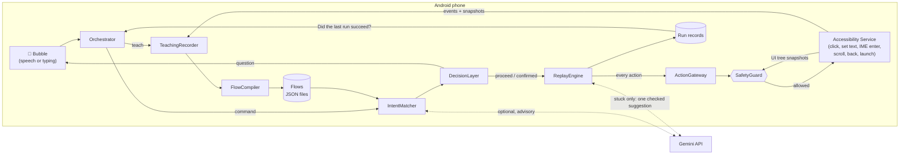
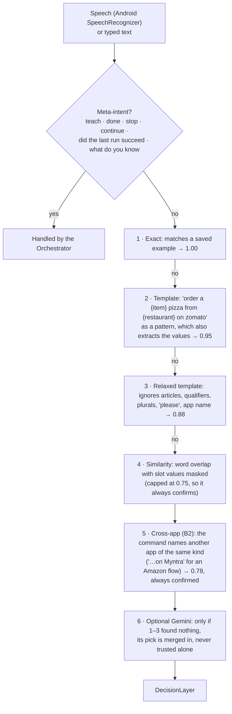
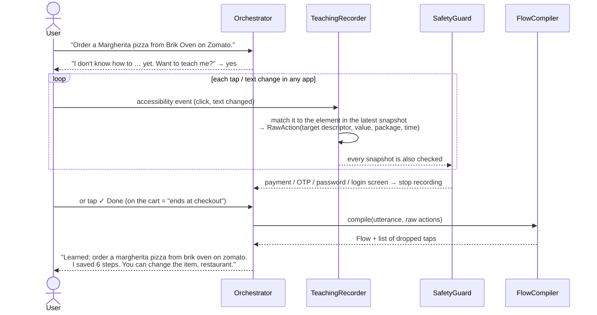
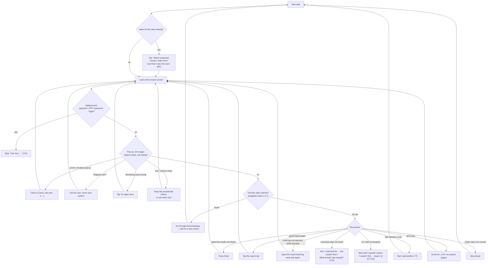
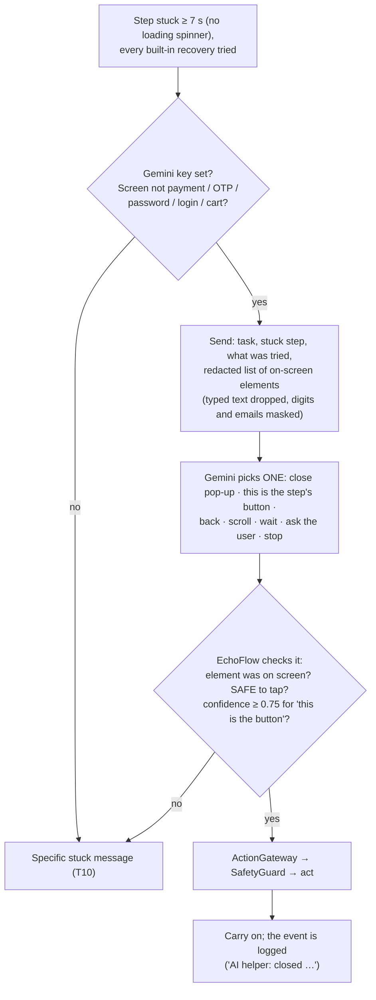
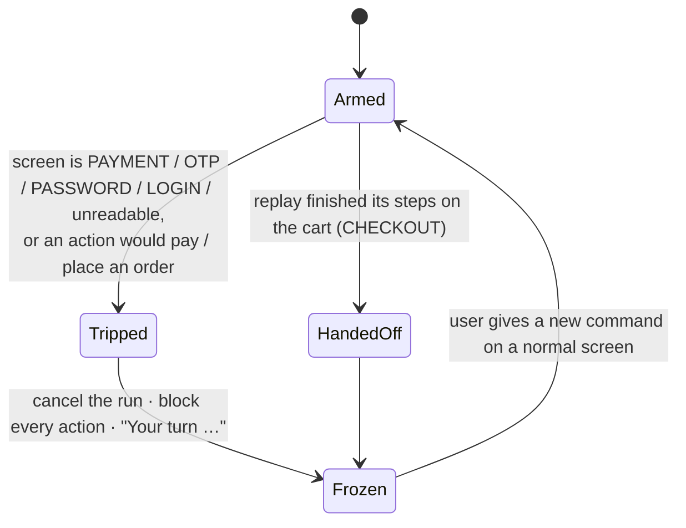

# EchoFlow — Architecture

EchoFlow is an Android app, written in Kotlin, that learns a phone task from one demonstration. You say a command it doesn't know, it offers to learn it, and you do the task by hand. From then on it repeats the task when you say that command, a paraphrase of it, or a version with different values ("a Farmhouse pizza", "two", "deliver to work").

- **Automation goes only through Android's Accessibility Service APIs.** It never uses app-specific SDKs, deep links or web fallbacks, and has no hard-coded flows: every flow comes from a demonstration.
- **It runs entirely on the phone.** It needs no server, account or API key. An LLM (Gemini) is optional and only helps match loosely worded commands. It never taps anything and never makes a safety decision.
- **Status:** implemented, with 130 JVM unit tests. It runs on a Galaxy S24 FE against real Zomato, Amazon and Myntra, and every official test has been run there ([TEST_RUN.md](TEST_RUN.md)).

See also: [LIMITATIONS.md](LIMITATIONS.md) · [TEST_MATRIX.md](TEST_MATRIX.md) · [RESEARCH.md](RESEARCH.md)

## Target apps (declared)

| Flow | App | Official tests | Slots learned |
|---|---|---|---|
| Food order, taught once | **Zomato** (Brik Oven stood in for Domino's, which doesn't deliver to the test address) | T1–T7, T10–T14, B1, B3 | `item` (with qualifiers such as "pizza"), `restaurant`, `qty`, `address` |
| E-commerce search, taught once | **Amazon** | T8, T9 | `item` (the search term); "first result" is positional |
| Cross-app replay of the Amazon flow | **Myntra** (Flipkart is also mapped, but untested) | B2 | `item` |

Swiggy was used for an earlier full run (see the bottom of [TEST_RUN.md](TEST_RUN.md)). Because nothing is app-specific, any app that exposes its screen to accessibility services can be taught (see [LIMITATIONS.md](LIMITATIONS.md) for the ones that don't).

---

## 1. The big picture

```mermaid
flowchart LR
  subgraph Phone["Android phone"]
    MIC["🎤 Bubble<br/>(speech or typing)"] --> ORC["Orchestrator"]
    ORC -->|"teach"| REC["TeachingRecorder"]
    REC --> FC["FlowCompiler"]
    FC --> STORE[("Flows<br/>JSON files")]
    ORC -->|"command"| IM["IntentMatcher"]
    STORE --> IM
    IM --> DL["DecisionLayer"]
    DL -->|"proceed / confirmed"| RE["ReplayEngine"]
    DL -->|"question"| MIC
    RE -->|"every action"| GW["ActionGateway"]
    GW --> SG{{"SafetyGuard"}}
    SG -->|"allowed"| AX["Accessibility Service<br/>(click, set text, IME enter,<br/>scroll, back, launch)"]
    AX -->|"UI tree snapshots"| SG
    AX -->|"events + snapshots"| REC
    RE --> RUNS[("Run records")]
    RUNS -->|"Did the last run succeed?"| ORC
  end
  IM <-.->|"optional, advisory"| LLM["Gemini API"]
  RE <-.->|"stuck only: one checked suggestion"| LLM
```

The code is split so that the logic can be tested without a phone:

| Module | Where | What it does |
|---|---|---|
| **`:core`** | pure Kotlin/JVM, no Android dependencies | All the decisions: matching, the decision policy, the flow compiler, replay, element resolution, safety classification, run records. **130 unit tests**, including real screen dumps from Swiggy, Zomato and Amazon |
| **`:app`** | Android | The Accessibility Service, screen capture, the floating bubble, voice, storage, the Gemini client, and the screens (home and Flow Inspector) |

**Rules that every part follows:**
1. **The only way to act is `ActionGateway.perform()`, and every call passes `SafetyGuard` first.** No other code can reach the service's action APIs.
2. **The LLM is advisory.**
   - **For matching:** its answer is merged into the local matcher's candidates and still goes through the DecisionLayer.
   - **For stuck replays** (§5b): it only suggests one recovery. EchoFlow checks the suggestion and passes it through the same safety gate as everything else. The LLM never makes a safety decision.
3. **Fail closed.** A screen it can't read counts as unsafe. An element it isn't sure about is not tapped; it asks instead.
4. **Sensitive content is never stored.** Password and OTP text is never recorded, and screen dumps are redacted (typed text dropped, digit runs and emails masked).

---

## 2. Speech-to-intent

```mermaid
flowchart TD
  A["Speech (Android SpeechRecognizer)<br/>or typed text"] --> M{"Meta-intent?<br/>teach · done · stop · continue ·<br/>did the last run succeed · what do you know"}
  M -->|yes| X["Handled by the Orchestrator"]
  M -->|no| E["1 · Exact: matches a saved example → 1.00"]
  E -->|no| T["2 · Template: 'order a {item} pizza from {restaurant} on zomato'<br/>as a pattern, which also extracts the values → 0.95"]
  T -->|no| R["3 · Relaxed template: ignores articles, qualifiers,<br/>plurals, 'please', app name → 0.88"]
  R -->|no| S["4 · Similarity: word overlap with slot values masked<br/>(capped at 0.75, so it always confirms)"]
  S --> C["5 · Cross-app (B2): the command names another app of the same kind<br/>('…on Myntra' for an Amazon flow) → 0.78, always confirmed"]
  C --> G["6 · Optional Gemini: only if 1–3 found nothing,<br/>its pick is merged in, never trusted alone"]
  G --> D["DecisionLayer"]
```

- **Values from the command.** Values are pulled out of the command itself:
  - "from X" becomes the `restaurant`;
  - "two" or "2" becomes `qty`;
  - "deliver to work" becomes `address`;
  - the rest fills `item`.
- **Normalising names.** Apostrophes and spacing are normalised, so "Domino's", "dominos" and "domino s" match.
- **DecisionLayer** (a pure function, tested as tables):

| Situation | Decision | Official test |
|---|---|---|
| Best score below 0.45 | *"I don't know how to … yet. Want to teach me? Say yes, then show me."* A yes starts teaching that command | T12 |
| Two flows within 0.15, or two template matches | *"I know more than one way to do that. first: …; second: …. Which one?"* | T13 |
| Below 0.8, a similarity match, or a cross-app run | Confirms first: *"Do you want me to order a pizza from a restaurant on zomato? I'll ask you which one."* | T13, B2 |
| Quantity over 10 | Confirms the number | T5 |
| Otherwise | Runs. A missing value is asked for when its step is reached | T2–T4, B3 |

- **The optional LLM.** With a Gemini key (pasted in the app under Advanced, or set at build time), commands that the local steps can't place are sent to Gemini with the list of learned flows (their templates, example phrasings and value names). Its pick and values are merged into the candidates and still go through the DecisionLayer. A run it helped with records the event "understood with Gemini".
- **Learning phrasings.** After a successful run, a new phrasing is saved as an example, so it matches exactly next time.

---

## 3. UI-tree capture

- **The service.** The Accessibility Service can retrieve window content, report view ids and read interactive windows. It watches every window (the app, dialogs, sheets and the keyboard) and records typed actions.
- **`SnapshotCapturer`** turns the node tree into a `ScreenSnapshot`, a flat list of elements. Each element carries:
  - its class, text, content description, hint and view id;
  - its bounds and window;
  - its flags: clickable, editable, password, scrollable, and so on;
  - its parent.
- **Its own bubble is skipped.** The bubble is a `TYPE_ACCESSIBILITY_OVERLAY`, so it needs no overlay permission.
- **Snapshots keep coming.** `LiveSnapshotStore` holds the latest one, and the replay waits for a *newer* snapshot after each action before looking again.
- **Blank frames.** Loading frames with no readable content are waited out, for 6 s at most. A screen that stays unreadable is treated as unsafe.

---

## 4. Teaching and generalisation

```mermaid
sequenceDiagram
  actor U as User
  participant O as Orchestrator
  participant R as TeachingRecorder
  participant G as SafetyGuard
  participant C as FlowCompiler
  U->>O: "Order a Margherita pizza from Brik Oven on Zomato."
  O-->>U: "I don't know how to … yet. Want to teach me?" → yes
  loop each tap / text change in any app
    U->>R: accessibility event (click, text changed)
    R->>R: match it to the element in the latest snapshot<br/>→ RawAction(target descriptor, value, package, time)
    R-->>G: every snapshot is also checked
  end
  G-->>O: payment / OTP / password / login screen → stop recording
  U->>O: or tap ✓ Done (on the cart = "ends at checkout")
  O->>C: compile(utterance, raw actions)
  C-->>O: Flow + list of dropped taps
  O-->>U: "Learned: order a margherita pizza from brik oven on zomato.<br/>I saved 6 steps. You can change the item, restaurant."
```

**How a tapped element is remembered.** Each tap is stored as an `ElementDescriptor`, never as coordinates alone. The descriptor holds:
- the view id and text;
- the content description and class;
- the parent's signature;
- the row context (the labels next to it, such as the dish name beside an ADD button);
- the relative position.

**FlowCompiler passes:**
1. **Noise removal (B1).** It drops:
   - taps in other apps, such as answering or declining a call, or the launcher icon;
   - several edits to one field, keeping only the final text;
   - double taps under the debounce time;
   - detours, where the user went somewhere and came back to the same screen without doing anything the command needs.

   The dropped taps are counted in the confirmation: *"I ignored 2 accidental or unneeded taps."*
2. **Slot extraction.** It compares the command with what was typed and tapped:
   - **Typed text:** "Brik Oven" was typed into search and appears after "from" in the command, so it becomes `{restaurant}`.
   - **Item:** "margherita" was typed and appears in the command, so it becomes `{item}`. Words said around it but not typed ("pizza") are kept as qualifiers.
   - **Quantity:** numbers become `{qty}`.
   - **Address:** "to home / work" becomes `{address}`.
   - **Template:** the command becomes the flow's template, for example `order a {item} pizza from {restaurant} on zomato`.
3. **Step building.** The kept actions become steps:
   - `LaunchApp(package)`: the app's launcher intent, the same as tapping its icon;
   - `TypeText(field, {slot} or literal)`;
   - `Tap(descriptor, slot?)`: a tap whose row mentions a slot value becomes "the ADD in the row for `{item}`";
   - `RepeatTap(stepper, {qty})`: repeated "+" taps.
4. **Steps some apps never report.** Some apps (Amazon's results, Zomato's suggestions) don't report their taps to accessibility services. When the command says so, the compiler adds the step:
   - "…add the first result…" gives `Tap(pick = first)`, which picks by position, not by the taught product's title (T9);
   - "…to cart" gives `Tap(pick = add_to_cart)`.
5. **The end point.** Teaching that stopped at a cart, payment or login screen is saved as "ends at checkout" or "ends at payment". Replay stops there and hands over.

The saved flow is a readable JSON file. The **Flow Inspector** screen shows:
- what you can say;
- the values you can change;
- every step, in plain words;
- that it hands over before paying.

---

## 5. Replay

```mermaid
flowchart TD
  S["Next step"] --> MISS{"Value for this step missing?"}
  MISS -->|yes| ASK["Ask: 'Which restaurant should I order from?<br/>Last time it was brik oven.' (B3)"] --> L
  MISS -->|no| L["Look at the newest screen"]
  L --> SAFE{"SafetyGuard:<br/>payment / OTP / password / login?"}
  SAFE -->|yes| HAND["Stop: 'Your turn. …' (T11)"]
  SAFE -->|no| POP{"Pop-up, error page,<br/>options sheet, cart dialog?"}
  POP -->|"promo / location pop-up"| DIS["Close it (Close, Not now, ✕…)"] --> L
  POP -->|"'Replace cart?'"| Q1["Ask the user, never auto-confirm"] --> L
  POP -->|"'Something went wrong'"| RETRY["Tap Try again once"] --> L
  POP -->|"size / options sheet"| OPT["Keep the preselected choice,<br/>or ask which size"] --> L
  POP -->|no| FIND{"Find the step's element<br/>(weighted match ≥ 0.7)"}
  FIND -->|found| ACT["Act through ActionGateway → wait for a new screen"] --> S
  FIND -->|not yet| REC{"Recoveries"}
  REC -->|"typed but results not shown"| ENTER["Press Enter"] --> L
  REC -->|"search field hidden"| OPEN["Tap the search bar"] --> L
  REC -->|"result tap not reported while teaching"| RES["Open the result matching what was typed"] --> L
  REC -->|"dish already in cart"| SKIP["Don't add another (T7)"] --> S
  REC -->|"a later step is on screen"| AHEAD["Skip ahead"] --> S
  REC -->|"off screen"| SCROLL["Scroll (3×, or 8× on product pages)"] --> L
  REC -->|"searched value not found"| NF["Ask: 'I searched for … but couldn't find it.<br/>What should I get instead?' (T10)"]
  REC -->|"12 s with no progress"| STUCK["Stop with a specific reason:<br/>'I couldn't find … (step 5 of 6)' (T10)"]
```

**ElementResolver** scores each on-screen element against the saved descriptor, using these weights:

| Feature | Weight |
|---|---|
| view id | 0.30 |
| text | 0.20 |
| row context | 0.20 |
| content description | 0.15 |
| parent | 0.10 |
| class | 0.05 |
| position | 0.05 |

Scores are normalised over the features the descriptor actually has. A tap needs **0.7**. A `{slot}` in the descriptor must match the new value, so "ADD in the Farmhouse row" is never confused with the Margherita row.

**Values the demonstration never touched:**
- **Quantity (T5).** At the cart, EchoFlow finds the item's − 1 + stepper and taps + until the number shown equals `qty`, reading the number after every tap. It never goes below 1.
- **Address (T6).** It opens the app's delivery-address bar, reads the saved-address list, and picks the one named in the command ("Work"). It remembers the choice per app.

**The same steps in another app (B2).** For a cross-app run, the flow is copied with only its `LaunchApp` changed. The same recoveries then find the search bar, the first product card, and "Add to cart / bag / basket". The copy is never saved over the taught flow.

**Actions.** Actions are sent with `ACTION_CLICK`, `ACTION_SET_TEXT`, `ACTION_IME_ENTER` and `ACTION_SCROLL`. Some apps accept a click and ignore it. For those, a tap gesture at the element's centre is tried, but only if nothing at that spot could pay, order or delete (`GestureSafety`, which came from a real near-miss on Zomato's cart).

---

## 5b. AI help when a replay is stuck (optional)

Replay is deterministic, and every recovery above runs without an LLM. With a Gemini key, there is one more, last-resort option. The idea follows SkillDroid: replay templates without an LLM, and use the LLM only when the screen deviates. **The AI is the safety net, not the driver.**

```mermaid
flowchart TD
  S["Step stuck ≥ 7 s (no loading spinner),<br/>every built-in recovery tried"] --> K{"Gemini key set?<br/>Screen not payment / OTP /<br/>password / login / cart?"}
  K -->|no| STOP["Specific stuck message (T10)"]
  K -->|yes| REQ["Send: task, stuck step, what was tried,<br/>redacted list of on-screen elements<br/>(typed text dropped, digits and emails masked)"]
  REQ --> ADV["Gemini picks ONE: close pop-up · this is the step's button ·<br/>back · scroll · wait · ask the user · stop"]
  ADV --> CHK{"EchoFlow checks it:<br/>element was on screen? SAFE to tap?<br/>confidence ≥ 0.75 for 'this is the button'?"}
  CHK -->|no| STOP
  CHK -->|yes| GATE["ActionGateway → SafetyGuard → act"] --> NEXT["Carry on; the event is logged<br/>('AI helper: closed …')"]
```

- **Limits:** at most 2 suggestions per step, a 4.5 s timeout per call, and never on sensitive or checkout screens. An element the model wasn't shown, or one the risk check doesn't call SAFE, is refused. So the model can't make EchoFlow pay, place an order or delete anything.
- **Asking you:** a question from the model is spoken like any other. "No" or "stop" ends the run without tapping anything else.
- **On the phone:** with the built-in pop-up rules switched off (debug builds only), Zomato's "Serving from exceptional distance" sheet was closed on Gemini's suggestion, and the run carried on ([TEST_RUN.md](TEST_RUN.md)).

## 6. Safety (T11)

```mermaid
stateDiagram-v2
  [*] --> Armed
  Armed --> Tripped: screen is PAYMENT / OTP / PASSWORD / LOGIN / unreadable,<br/>or an action would pay / place an order
  Armed --> HandedOff: replay finished its steps on the cart (CHECKOUT)
  Tripped --> Frozen: cancel the run · block every action · "Your turn …"
  HandedOff --> Frozen
  Frozen --> Armed: user gives a new command on a normal screen
```

- **`ScreenSafetyClassifier`** is local and deterministic, with no network and no LLM. A screen is flagged from signals:
  - password fields;
  - OTP-shaped fields next to "OTP / verify";
  - payment words and card, UPI or CVV fields;
  - login forms;
  - payment and wallet apps.

  A cart with a Pay or Place Order button, but no card, UPI or OTP fields, is **CHECKOUT**: quantity and address can still be set there. The Pay button itself is never tapped.
- **`ActionRiskClassifier`** labels every tap target, reading its label, view id and child labels:
  - **SAFE**;
  - **NAVIGATES_TO_PAYMENT**;
  - **COMMIT**: *Pay*, *Place order*, *Buy now*, *Slide to pay*…, never performed;
  - **DESTRUCTIVE**: *Remove*, *Clear cart*…, only when explicitly taught.
- **Hand-off messages** start with *"Your turn."* and state the total: *"Your turn. Everything is ready for payment, total ₹343. I won't pay. Please check the order and pay yourself."*
- **Stopping at a login screen counts as not succeeding.** A run that stops at login or an unreadable screen is reported as "didn't succeed" (T10, T14). A normal stop at payment counts as success.

---

## 7. Run records and reporting (T14)

Every run is saved as a `RunRecord` with:
- the command and the flow;
- the values used;
- the status: `COMPLETED`, `HANDED_OFF`, `HALTED`, `NO_ANSWER` or `CANCELLED`;
- the step it stopped at, and that step's description;
- the message;
- a list of events such as "closed popup via Not now", "set quantity to 2" or "delivery address: Work".

*"Did the last run succeed?"* is answered from a template, with no LLM, so it always matches the record:
- *"Yes, the last run succeeded. …"*
- *"No, the last run didn't succeed. Order a margherita pizza from brik oven on zomato stopped at step 5 of 6 (Tap "ADD"). …"*

---

## 8. Voice and UI

- **Voice:** push-to-talk with Android `SpeechRecognizer`, and answers read aloud with `TextToSpeech`. Every question can also be answered by tapping a choice chip or typing.
- **Bubble:** a floating bubble on top of every app. It has a mic, ✓ Done while teaching, ■ Stop while running, and the current status and question.
- **App screens:** a home screen with the learned flows and recent runs, and the **Flow Inspector** for each flow.

---

## 9. Testing

- **`:core` unit tests (130):**
  - every official test phrase (T1–T14, B1–B3) against a synthetic Zomato/Domino's demonstration (`RubricPhrasesTest`);
  - replay against scripted fake phones (`ReplayEngineTest`), including Zomato's already-in-cart, Amazon's AI summary and video ad above the results, and Myntra's delivery bar, hint-only search bar, similar-products buttons and size sheet;
  - safety classification on real screen dumps (`ScreenSafetyClassifierTest`).
- **On the phone:** the official T1–T14, B2 and B3 were run on a Galaxy S24 FE with real apps. The results and every fix found are in [TEST_RUN.md](TEST_RUN.md).
